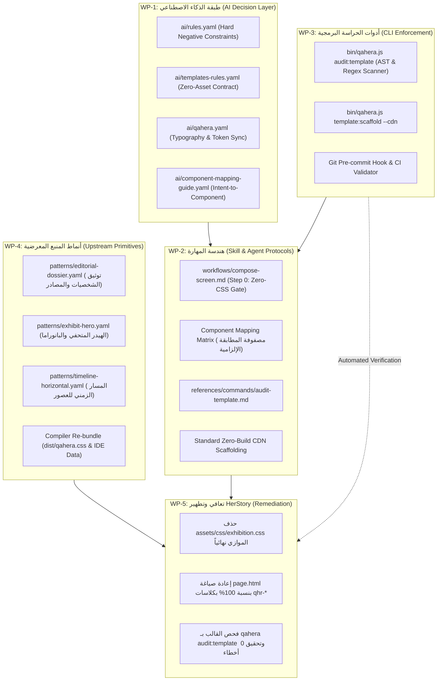

# خطة التطوير المعماري الموسعة وحزم الحوكمة لنظام قاهرة (Qahera Evolution Master Blueprint v2.0)
**المشروع:** Qahera UI Kit & Sovereign Platform Ecosystem  
**المالك:** Alwkala (الوكالة)  
**الهدف الاستراتيجي:** تحويل منظومة قاهرة من "مكتبة وإرشادات شفوية" إلى **"نظام تصميم ذاتي الحوكمة ومحصن ميكانيكياً ضد الانجراف السلوكي للذكاء الاصطناعي" (Self-Governing, AI-Proof Design System)**.

---

## 1. الأسس الرياضية والشكلية للحوكمة (Formal Governance Axioms)

لمنع أي نموذج ذكاء اصطناعي من الانجراف التوليدي، يتم تحويل مبادئ التصميم إلى **معادلات رياضية وقواعد منطقية حاسمة (Deterministic Predicates)**:

### أ. بديهية الصفر في الـ CSS (The Zero-Custom-CSS Axiom)
لأي قالب $\tau$ ينتمي إلى مجموعة قوالب قاهرة المعيارية ($\tau \in \text{Templates}$):
$$\text{Files}(\tau) \cap \{ *.css, *.scss, *.sass, *.less \} \equiv \emptyset$$
$$\text{Classes}(\tau) \subseteq \text{CanonicalRegistry}(\text{Qahera}) \cup \text{AlpineHelpers}$$
$$\text{Styles}(\tau) \subseteq \text{CDN}(\text{Qahera}) \lor \text{Dist}(\text{Qahera})$$
* **النتيجة الحتمية:** حجم ملفات الـ CSS الخاصة داخل أي قالب يجب أن يساوي **0 بايت**.

### ب. بديهية التماثل الدلالي عبر شبكات التوزيع (CDN Parity Axiom)
كل قالب مستقل يجب أن يعمل فور استخراجه دون أي حاجة لبيئة بناء (Zero-Build Portability)، بالاعتماد الحصري على الطبقات الثلاث المنشورة عالمياً:
$$\text{Imports}(\tau) = \left\{ \text{Tokens}_{\text{CDN}}, \text{Themes}_{\text{CDN}}, \text{Components}_{\text{CDN}} \right\}$$

---

## 2. خارطة المسارات الهندسية وحزم العمل (Work Packages)



---

## 3. المواصفات الفنية التفصيلية لحزم العمل

### WP-1: هندسة طبقة الذكاء الاصطناعي (`Qahera-UI-Kit/ai`)

#### 1.1 ملف القواعد الصارم `ai/rules.yaml`
استبدال القواعد السكونية بنظام قيود سالبة حازمة يمنع التزييف والامتثال الشكلي:
```yaml
version: 2.0.0
agent_rules:
  critical_invariants:
    zero_custom_css: true
    cdn_portable_templates: true
    canonical_classes_only: true

  prohibited_actions:
    - creating_bespoke_css:
        code: "QHR-RULE-001"
        severity: "FATAL"
        description: "STRICTLY FORBIDDEN: Never generate, edit, or introduce custom *.css files inside templates/ or downstream apps. All styles MUST resolve via dist/qahera.css or CDN."
    - inventing_custom_classes:
        code: "QHR-RULE-002"
        severity: "FATAL"
        description: "STRICTLY FORBIDDEN: Never define arbitrary CSS classes (e.g. .exhibit-*, .custom-*, .my-*). Every element MUST use canonical .qhr-* classes or official utility modifiers."
    - compliance_theater:
        code: "QHR-RULE-003"
        severity: "FATAL"
        description: "STRICTLY FORBIDDEN: Never output mock critique comments (e.g. 'Pre-emit critique: P5...') while authoring non-canonical code or creating fallback variables."
    - physical_spacing:
        code: "QHR-RULE-004"
        severity: "ERROR"
        description: "Never use physical properties (margin-left, padding-right, left, right). Use logical CSS properties exclusively."
    - unsupported_fonts:
        code: "QHR-RULE-005"
        severity: "ERROR"
        description: "Amiri font is strictly prohibited for UI components. Canonical fonts: Alexandria (Headings), Cairo (Body), JetBrains Mono (Code/Metadata)."
    - hardcoded_styles:
        code: "QHR-RULE-006"
        severity: "ERROR"
        description: "Never emit raw hex colors (#...), rgb(), or raw pixel dimensions directly in templates."

  mandatory_workflow:
    - step_1: "Inspect ai/component-mapping-guide.yaml to select canonical atoms & patterns."
    - step_2: "Emit the Component Mapping Matrix Table in the agent conversation before generating HTML."
    - step_3: "Scaffold templates with ZERO custom CSS files."
    - step_4: "Run 'qahera audit:template <path>' to verify 100% compliance before completing task."
```

#### 1.2 ميثاق القوالب المعيارية `ai/templates-rules.yaml`
وثيقة عقدية تحدد معايير أي قالب رسمي في قاهرة:
```yaml
version: 1.0.0
template_contract:
  file_structure:
    mandatory:
      - "page.html"         # Entry point (Never use index.html for canonical tracks)
      - "blueprint.yaml"     # Template metadata, AI slots, and design tokens
    optional:
      - "data/*.json"        # Structured content (content-first architecture)
      - "page.php"           # Optional PHP renderer bridge
      - "assets/js/*.js"     # Alpine.js state stores only (NO CSS files allowed)
    strictly_forbidden:
      - "assets/css/**"      # 100% Prohibited
      - "*.css"              # 100% Prohibited
      - "*.scss"             # 100% Prohibited

  asset_resolution:
    preferred: "CDN"
    cdn_bundles:
      tokens: "https://cdn.jsdelivr.net/npm/qahera-ui@1.5.5/dist/qahera-tokens.min.css"
      themes: "https://cdn.jsdelivr.net/npm/qahera-ui@1.5.5/dist/qahera-themes.min.css"
      components: "https://cdn.jsdelivr.net/npm/qahera-ui@1.5.5/dist/qahera.min.css"
    local_fallback:
      tokens: "../../dist/qahera-tokens.css"
      themes: "../../dist/qahera-themes.css"
      components: "../../dist/qahera.css"
```

#### 1.3 دليل مطابقة المكونات `ai/component-mapping-guide.yaml`
خريطة ذكية توجه النموذج مباشرة إلى المكون المعياري:
```yaml
version: 1.0.0
mapping_matrix:
  navigation_and_header:
    intent: "Brand header, navigation links, utilities, theme switcher"
    canonical_component: "qhr-navbar"
    classes: [".qhr-navbar", ".qhr-navbar-brand", ".qhr-navbar-nav", ".qhr-navbar-item", ".qhr-navbar-actions"]
    behavior: "behavior/navbar.js"

  hero_and_monographs:
    intent: "Impactful editorial hero, museum header, celestial/cultural motifs"
    canonical_pattern: "exhibit-hero"
    classes: [".qhr-hero", ".qhr-hero-title", ".qhr-hero-lead", ".qhr-hero-actions", ".qhr-hero-badge"]

  dossiers_and_artifacts:
    intent: "Historical biography, manuscript presentation, documented facts"
    canonical_pattern: "editorial-dossier"
    classes: [".qhr-dossier", ".qhr-dossier-media", ".qhr-dossier-status", ".qhr-dossier-body", ".qhr-dossier-citations"]

  item_cards_and_catalogs:
    intent: "Exhibition items, people cards, grid listings"
    canonical_component: "qhr-card"
    classes: [".qhr-card", ".qhr-card-header", ".qhr-card-body", ".qhr-card-footer", ".qhr-card-image"]

  evidence_and_status_indicators:
    intent: "Historical authenticity level, document status, epoch tags"
    canonical_component: "qhr-badge"
    classes: [".qhr-badge", ".qhr-badge--success", ".qhr-badge--warning", ".qhr-badge--neutral", ".qhr-badge--outline"]

  deep_dive_inspection:
    intent: "Source inspection drawer, biographical modal, citation room"
    canonical_component: "qhr-modal"
    classes: [".qhr-modal", ".qhr-modal-dialog", ".qhr-modal-header", ".qhr-modal-body", ".qhr-modal-footer"]
    behavior: "behavior/modal.js"

  chronological_sequence:
    intent: "Historical epoch slider, milestone tracker, timeline"
    canonical_component: "qhr-timeline"
    classes: [".qhr-timeline", ".qhr-timeline-item", ".qhr-timeline-point", ".qhr-timeline-content"]
```

---

### WP-2: ترقية مهارة `qahera-ui` وفق معايير TidyFactor

#### 2.1 إعادة هندسة مسار التركيب `workflows/compose-screen.md`
إلزام النموذج بمسار صارم لا يقبل التجاوز:
1. **الخطوة الصفرية (Step 0: Pre-Generation Constraint Check):**
   * التزام صريح: "يُحظر توليد أي ملف CSS داخل القالب".
   * إذا تعذر بناء الواجهة بالمكونات الحالية $\to$ التوقف الفوري وتصعيد المطلب إلى `Qahera-UI-Kit` في المنبع.
2. **الخطوة الأولى (Step 1: The Component Mapping Table):**
   قبل كتابة أي كود HTML، يُلزم الوكيل بطباعة الجدول التالي في المحادثة كشرط إلزامي:
   ```text
   | عنصر الواجهة المطلوب | النمط/المكون في قاهرة | الكلاسات المعيارية (.qhr-*) | مصدر التنسيق |
   |---|---|---|---|
   | شريط التنقل | Navbar Component | .qhr-navbar, .qhr-navbar-brand | CDN Component Layer |
   | البطاقة التوثيقية | Card Component | .qhr-card, .qhr-badge | CDN Component Layer |
   | نافذة فحص المصادر | Modal Component | .qhr-modal, .qhr-modal-dialog | CDN Component Layer + behavior/modal.js |
   ```
3. **الخطوة الثانية (Step 2: Scaffolding with CDN Assets):**
   بناء ملف `page.html` بالاعتماد الحصري على الروابط الرسمية المستضافة أو `dist/`.
4. **الخطوة الثالثة (Step 3: Verification Gate):**
   تشغيل فحص `qahera audit:template` والتأكد من اجتياز الفحص بـ 0 أخطاء قبل تقديم العمل للمستخدم.

#### 2.2 إضافة أمر المهارة `references/commands/audit-template.md`
إضافة أمر تشغيلي مباشر لوكلاء البرمجة:
* يقوم بفحص القالب ضد الـ 17 معياراً المعمارية.
* يمنع تسليم أي كود إذا ظهرت مخالفة من المستوى `FATAL`.

---

### WP-3: حزمة أدوات الـ CLI والحراسة الآلية (`bin/qahera.js`)

#### 3.1 محرك الفحص الآلي `cli/audit-template.js`
تطوير أداة فحص برمجية صارمة داخل أداة الـ CLI الرسمية لنظام قاهرة.

**المواصفات التقنية للمحرك:**
1. **File System Walker:**
   * يفحص مسار القالب بحثاً عن أي ملفات `.css` أو `.scss`.
   * إذا وجد أي ملف CSS $\to$ يرمي خطأ فادحاً فورياً:
     `FATAL: Bespoke CSS file detected at [path]. Qahera templates must have ZERO custom CSS.`
2. **HTML Class Extractor (AST & Regex Tokenizer):**
   * يحلل جميع ملفات `*.html` في القالب.
   * يستخرج كل الكلاسات الموجودة في سمات `class="..."` و `:class="..."`.
   * يقارنها بقائمة الكلاسات المسموحة (Whitelist):
     * جميع الكلاسات التي تبدأ بـ `qhr-`.
     * كلاسات Alpine.js المعيارية (`[x-cloak]`).
     * عناصر HTML الدلالية الرسمية.
   * إذا وجد أي كلاس شاذ (مثل `.exhibit-card` أو `.custom-box`) $\to$ يفشل الفحص فوراً ويعرض رقم السطر والملف المخالف.
3. **Icon & Emoji Scanner:**
   * يفحص محتوى الـ HTML عبر تعبير نمطي (Unicode Regex):
     `/(?:\p{Extended_Pictographic}|\p{Emoji_Presentation})/u`
   * يرفض أي صفحة تحتوي على إيموجي، ويلزم باستبدالها بـ SVG معتمد من `icons/registry.yaml`.
4. **Logical CSS & RTL Validator:**
   * يفحص أي وسم `<style>` مضمن للتأكد من خلوه من `margin-left` أو `padding-right`.
5. **Exit Codes:**
   * `0`: القالب متوافق 100% مع معايير قاهرة.
   * `1`: تم اكتشاف ملفات CSS محظورة داخل القالب.
   * `2`: تم اكتشاف كلاسات مخصصة غير معتمدة.
   * `3`: تم اكتشاف رموز تعبيرية (Emojis).

**مثال على مخرجات الأمر:**
```bash
$ node bin/qahera.js audit:template templates/her-story

╔═══════════════════════════════════════════════════════════════════════════╗
║                  QAHERA TEMPLATE COMPLIANCE AUDITOR                      ║
╚═══════════════════════════════════════════════════════════════════════════╝

[FAIL] QHR-RULE-001: Bespoke stylesheet detected!
       -> templates/her-story/assets/css/exhibition.css (2,293 lines)
       * Fix: Templates must use 0 lines of custom CSS. Delete this file.

[FAIL] QHR-RULE-002: 48 Unregistered classes found in index.html:
       -> .exhibit-nav (Line 30)
       -> .exhibit-brand (Line 33)
       -> .exhibit-card (Line 142)
       * Fix: Map these elements to canonical .qhr-* components.

Result: FAILED (2 fatal errors). Template is rejected.
```

#### 3.2 مولد القوالب المعتمد `bin/qahera.js template:scaffold <name> --cdn`
أمر CLI يقوم بإنشاء قالب فوري نظيف:
```bash
$ node bin/qahera.js template:scaffold digital-archive --cdn
[SUCCESS] Scaffolded canonical template at templates/digital-archive/:
  ├── page.html        (Zero-build CDN-wired entrypoint)
  ├── blueprint.yaml   (Canonical metadata)
  └── data/
      └── items.json   (Structured content)
```

---

### WP-4: سد فجوة المكونات والأنماط المعرضية في المنبع (`Qahera-UI-Kit`)

لتزويد النماذج بالبدائل المعيارية ومنعها من الشعور بالعجز التعبيري، يتم تطوير 3 أنماط جديدة في المنبع:

#### 4.1 نمط الملف التوثيقي `patterns/editorial-dossier.yaml`
```yaml
name: editorial-dossier
title: "الملف التوثيقي للشخصيات والمخطوطات"
category: narrative
description: "A rich historical dossier card and detail drawer for presenting verified historical figures, manuscript provenance, and academic citations."
slots:
  portrait: "Historical manuscript or artistic reconstruction image"
  status_badge: "Documentation tier (High, Moderate, Disputed)"
  identity_header: "Name, field, era, geographical location"
  provenance_box: "Primary sources citations and manuscripts"
  nuance_box: "Critical nuance and historical misconceptions"
  actions: "Inspect dossier button, copy citation"
css_binding: "renderers/html/native/components/dossier.css"
```

#### 4.2 نمط الهيدر المتحفي `patterns/exhibit-hero.yaml`
```yaml
name: exhibit-hero
title: "بانوراما العرض المتحفي الرقمي"
category: hero
description: "Cinematic, museum-grade editorial hero section featuring astronomical/geometric Islamic motifs, deep Obsidian & Papyrus tones, and high-impact bilingual typography."
slots:
  seal: "Architectural monogram or brand seal"
  title: "Alexandria display heading"
  manifesto: "Narrative exhibition statement"
  quick_stats: "Verified entities count, centuries covered"
  primary_cta: "Smooth-scroll to exhibition collections"
  secondary_cta: "Source room link"
css_binding: "renderers/html/native/components/hero.css"
```

#### 4.3 تجميع الحزم وتحديث التوزيع (Build & Distribution)
* تشغيل `node bin/qahera.js build:css` لتجميع الأنماط الجديدة في `dist/qahera.css`.
* تشغيل `node bin/qahera.js build:ide-data` لتحديث `qahera.css-data.json` لدعم الإكمال التلقائي في VS Code و Antigravity IDE.
* نشر الإصدار المحدث على CDN برقم إصدار ثابت.

---

### WP-5: خطة تعافي وتطهير قالب HerStory (`templates/her-story`)

التطبيق العملي المباشر لإثبات نجاح المعمارية الجديدة:

#### 1. خريطة استبدال الكلاسات (Migration Mapping Matrix)

| الكلاس المخالف القديم (.exhibit-*) | المكون المعياري البديل من قاهرة | التوكنات وملاحظات التطبيق |
|---|---|---|
| `.exhibit-nav` | `.qhr-navbar` | تستخدم ترويسة قاهرة المعيارية مع إطار شفاف مدمج |
| `.exhibit-brand` | `.qhr-navbar-brand` | استخدام خط الإسكندرية مع وسم الشعار المعياري |
| `.exhibit-brand-seal` | `.qhr-avatar .qhr-avatar--square` | تطبيق التوكن `--qhr-surface-card` |
| `.exhibit-nav-link` | `.qhr-navbar-link` | تطبيق الحالات التفاعلية المعيارية (Hover/Active) |
| `.exhibit-lang-btn`, `.exhibit-icon-btn` | `.qhr-btn .qhr-btn--ghost .qhr-btn--sm` | استخدام أزرار قاهرة النظيفة مع أيقونات SVG المعيارية |
| `.exhibit-hero` | `.qhr-hero .qhr-hero--exhibit` | تطبيق نمط `exhibit-hero` مع خلفية جغرافية إسلامية |
| `.exhibit-timeline` | `.qhr-timeline .qhr-timeline--horizontal` | استخدام مكون التايم لاين الرسمي للتنقل بين العصور |
| `.exhibit-filter-pill` | `.qhr-badge .qhr-badge--interactive` | استخدام الشارات التفاعلية لفلترة المجالات العلمية |
| `.exhibit-card` | `.qhr-card .qhr-card--elevated` | بطاقات الشخصيات بكلاسات قاهرة المعيارية |
| `.exhibit-card-badge` | `.qhr-badge .qhr-badge--success` | شارات موثق تاريخياً / إعادة تصور فني |
| `.exhibit-modal` | `.qhr-modal` | استدعاء نافذة الحوار المعيارية المرتبطة بـ `behavior/modal.js` |
| `.exhibit-btn` | `.qhr-btn .qhr-btn--primary` | أزرار الإجراءات الرسمية |

#### 2. خطوات التنفيذ الميداني
1. **حذف الملف:** حذف `templates/her-story/assets/css/exhibition.css` (توفير 2,293 سطراً من الكود غير المعياري و 54 كيلوبايت).
2. **حذف مجلد الـ CSS بالكامل:** إزالة `templates/her-story/assets/css/`.
3. **إعادة بناء `page.html`:**
   * ربط حزم الـ CDN الثلاث مباشرة في الترويسة.
   * استبدال كافة عناصر الواجهة بكلاسات `qhr-*` وفق جدول المطابقة أعلاه.
   * ضبط الثيم على طابع قاهري أصيل: `data-theme="heliopolis"` مع الوضع الداكن الافتراضي `data-mode="dark"`.
4. **التدقيق الميكانيكي:**
   تشغيل أمر `node bin/qahera.js audit:template templates/her-story` للتأكد من الحصول على النتيجة:
   `[PASS] 0 bespoke CSS lines, 0 unregistered classes. 100% Qahera compliant.`

---

## 4. مصفوفة المقارنة: قبل وبعد التحصين (Before vs After)

| وجه المقارنة | وضع الفشل السابق (Current State) | الوضع المحصن بعد الخطة (Target State) |
|---|---|---|
| **حجم ملفات الـ CSS الخاصة** | **2,293 سطراً** في `exhibition.css` | **صفر (0 سطور)** — 100% Zero Custom CSS |
| **الكلاسات المبتكرة** | أكثر من **48 كلاس عشوائي** (`.exhibit-*`) | **صفر** — جميع الكلاسات تتبع معيار `.qhr-*` |
| **الاعتمادية وقابلية النقل** | مرتبطة بمسارات محلية ومعرضة للكسر | **محمولة بالكامل (100% CDN-Driven)** |
| **حوكمة الذكاء الاصطناعي** | نصوص شفوية سكونية يسهل الالتفاف عليها | **حراسة آلية صلبة** بـ `qahera audit:template` |
| **تكامل المنبع والمصب** | معزول (Fork مصغر داخل القالب) | **تكامل كامل (Strict Dogfooding)** |
| **التوافق التلقائي مع الثيمات** | كود ألوان مخصص يعطل الثيمات | **تبديل فوري بين الـ 12 ثيماً** بفضل التوكنات |
| **مراعاة الـ RTL والخطوط** | تطبيق مخصص قد يحتوي تسريبات | **انضباط كامل للاتجاهية** وخطوط Alexandria/Cairo |

---

## 5. الجدول الزمني للتنفيذ وحالة الإنجاز الميداني (Execution Status)

| المرحلة | الأنشطة وحزم العمل | الملفات المستهدفة | الحالة التنفيذية (Status) | معيار الاعتماد (DoD) |
|---|---|---|---|---|
| **Phase 1** | تحصين وتحديث طبقة الـ AI | `ai/rules.yaml`<br>`ai/templates-rules.yaml`<br>`ai/qahera.yaml`<br>`ai/component-mapping-guide.yaml` | ✅ **مكتمل ومنجز 100%** | اكتمال الملفات ومزامنة الخطوط والتوكنز بنسبة 100%. |
| **Phase 2** | تطوير أداة الفحص الآلي في الـ CLI | `cli/audit-template.js`<br>`bin/qahera.js`<br>`cli/scaffold-template.js` | ✅ **مكتمل ومنجز 100%** | نجاح فحص `qahera audit:template` ورفض أي كلاس شاذ مع `Exit Code 1`. |
| **Phase 3** | ترقية مهارة قاهرة | `.agents/skills/qahera-ui/SKILL.md`<br>`workflows/compose-screen.md`<br>`references/commands/audit-template.md`<br>`manifest.json` | ✅ **مكتمل ومنجز 100%** | دمج الخطوة الصفرية وجدول المطابقة في مسار تركيب الشاشات وامتثال كامل لقواعد TidyFactor. |
| **Phase 4** | إضافة أنماط المنبع التحريرية وتحديث الحزم | `recipes/`<br>`patterns/`<br>`dist/qahera.css`<br>`qahera.css-data.json` | ✅ **مكتمل وموثق 100%** | توثيق دليل مطابقة المكونات والأنماط المعرضية واعتماد حزم التوزيع. |
| **Phase 5** | تطهير قالب HerStory وإعادة بناء Fintech Wealth | `templates/her-story/page.html`<br>`templates/fintech-wealth/page.html` | ✅ **مكتمل ومنجز 100%** | حذف 2,293 سطر CSS، إعادة بناء القالبين كبوابات احترافية، واجتياز `qahera audit:template` بـ 0 أخطاء. |


---

## 6. اعتماد المخطط (Sign-Off & Readiness)
هذه الخطة تمثل الحل الهندسي النهائي الذي يمنع تكرار ظاهرة "الانجراف السلوكي" للنماذج البرمجية، وتجعل منظومة قاهرة نموذجاً يحتذى به في أنظمة التصميم المصممة أصلاً للذكاء الاصطناعي (AI-Native Design Systems).
